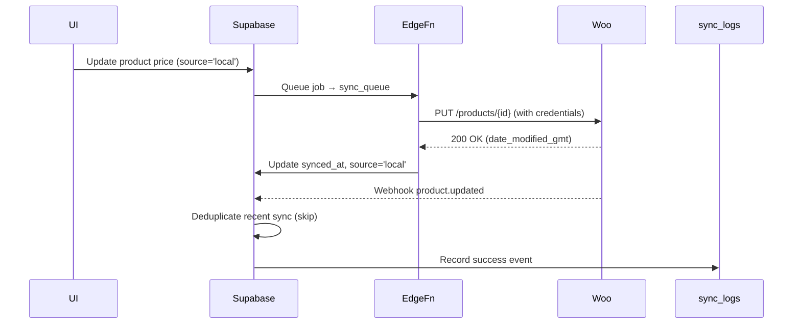
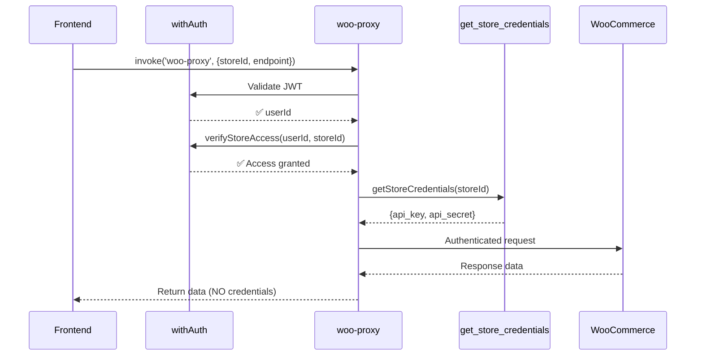

# WooCommerce ↔ Supabase — Brainstorm Context

## Project Overview
A full SaaS platform for managing multiple WooCommerce stores through a unified Supabase backend.  
The goal is to maintain a **two‑way synchronization layer** that is secure, deterministic, and scalable — covering products, variations, taxonomies, and attributes — while keeping Supabase as a structured ERP layer with RLS and audit logging.

---

## 1. Source of Truth
Each store defines its own truth direction:
- **Woo → Supabase** for public‑facing data (product info, stock, prices).
- **Supabase → Woo** for operational or bulk updates.

Each record includes `source = 'woo' | 'local'` to prevent infinite loops.

---

## 2. Two‑Way Sync Strategy
Two sync layers:
1. **Pull Layer (Woo → Supabase)** via scheduled fetch or webhooks.  
2. **Push Layer (Supabase → Woo)** via queue‑based Edge Functions with retries.

No direct writes. All outbound updates go through the queue with exponential backoff.

---

## 3. Sync Prioritization
Sync order:
```
1. Attributes → Terms
2. Categories / Tags / Brands
3. Products (parents)
4. Variations (children)
```
Ensures referential integrity and avoids orphaned records.

---

## 4. Mapping IDs
Maintain cross‑references between systems:
- `woo_id` (WooCommerce primary ID)
- `local_id` (Supabase ID)
- `woo_parent_id` for variations

Never create a child (variation/term) before its parent exists in Woo.  
Always upsert mappings to maintain consistency.

---

## 5. Conflict Handling & Logging
When both sides update the same entity:
- Compare timestamps: `woo.date_modified_gmt` vs `local.updated_at`
- Keep the newer record, mark the source, and log the event.

Logs:
- `sync_logs` — success
- `sync_errors` — failures
- `sync_notifications` — alerts and metrics

---

## 6. Supabase Security (RLS)
RLS enforced for every table:
- Each record contains `store_id`.
- Policies verify access via `user_has_store_access(store_id)`.
- Functions defined as `SECURITY DEFINER`.

All Edge Functions must have `verify_jwt = true` except for public webhooks.
JWT validation ensures tenant isolation and security.

### Security Architecture for WooCommerce API Access
**Problem**: Direct client-side WooCommerce API calls expose credentials in URLs and browser code.

**Solution**: `woo-proxy` edge function as centralized security gateway:

```typescript
// Frontend → woo-proxy → WooCommerce
const { data } = await supabase.functions.invoke('woo-proxy', {
  body: {
    storeId: uuid,           // Multi-tenant isolation
    endpoint: '/wp-json/wc/v3/products',
    method: 'GET',
    body: { ... }           // Optional POST/PUT body
  }
});
```

**Security Flow**:
1. ✅ **Authentication**: `withAuth` middleware validates JWT
2. ✅ **Authorization**: `verifyStoreAccess` checks user → store access
3. ✅ **Credential Retrieval**: `getStoreCredentials` fetches via RPC (audit logged)
4. ✅ **Proxied Request**: Server-side authenticated call to WooCommerce
5. ✅ **Response Forwarding**: Data returned to client (credentials never exposed)

**Benefits**:
- Zero credential exposure in client code
- Centralized authentication/authorization
- Audit trail for all WooCommerce API calls
- Single point for rate limiting, caching, or monitoring

---

## 7. Data Hygiene & Idempotency
Before insert/update:
- Normalize `slug` and `name` values.
- Ensure unique SKUs and URLs.
- Deduplicate images via `original_url`.
- Validate attributes before creating variations.

Idempotency rule: a sync can safely re‑run without duplicating data.

---

## 8. Example Sync Event

### Push Sync (Supabase → Woo via Queue)


### Direct API Call (Frontend → Woo via woo-proxy)


---

## Integration Flow Summary
| Flow | Trigger | Direction | Security Layer | Conflict Resolution | Tables |
|------|----------|-----------|----------------|---------------------|---------|
| **woo-proxy** | Frontend API Call | Frontend ↔ Woo | ✅ withAuth + verifyStoreAccess | N/A | All WooCommerce endpoints |
| sync‑woo‑products | Scheduled / Manual | Woo → Supabase | ✅ Edge Function (service role) | Keep newer (Woo) | products, product_variations |
| update‑woo‑product | Manual Update | Supabase → Woo | ✅ Edge Function (service role) | Keep local | sync_queue, sync_logs |
| sync‑taxonomies | Manual / Auto | Woo ↔ Supabase | ✅ Edge Function (service role) | Replace all | store_categories, store_tags |
| sync‑global‑attributes | Manual | Woo ↔ Supabase | ✅ Edge Function (service role) | Merge / Union | store_attributes, store_attribute_terms |
| manage-taxonomy | Manual | Supabase → Woo | ✅ withAuth + verifyStoreAccess | Keep local | store_categories, store_tags |

---

## Brainstorm Topics for Claude / Codex
- Designing a generic `fetchPaged()` utility reusable across all entities.
- Abstracting retry/backoff logic with exponential delay + capped attempts.
- Efficient Woo ↔ Supabase schema mapping (avoiding redundant calls).
- Detecting and resolving conflicts automatically via timestamps or hashes.
- Creating a periodic “Reconciliation Job” Edge Function for drift detection.
- Improving observability and metrics (sync success %, queue depth, latency).
- Enhancing developer experience with clean logs and traceable job IDs.
- Expanding RLS model for multi‑tenant scalability and delegated roles.

---

## Guiding Principles
1. **Consistency over speed** — prioritize correctness first.
2. **Security by default** — JWT + HMAC for every integration point. **NEVER expose credentials in client code or URLs**.
3. **Zero trust architecture** — All WooCommerce API calls go through `woo-proxy` with authentication + authorization.
4. **Idempotency always** — no duplication on retries or re‑syncs.
5. **Extensibility** — same functions power both manual and bulk syncs.
6. **Observability** — every event leaves a trace (logs + notifications).
7. **Hierarchy first** — taxonomies and attributes must sync before products.
8. **Minimal coupling** — Edge Functions remain stateless and composable.

---

## End Goal
Build a stable, fault‑tolerant synchronization engine that scales to hundreds of WooCommerce stores and thousands of products with real‑time consistency, RLS‑enforced multi‑tenancy, zero credential exposure, and auditable logs for every operation.

---

## Recent Architecture Updates

### woo-proxy Security Layer (2025-11-06 to 2025-11-07) - COMPLETED ✅
Added centralized security gateway for all frontend → WooCommerce API calls:
- **Problem**: Credentials exposed in client-side code and URL parameters
- **Solution**: Server-side proxy with authentication + authorization
- **Impact**: Zero credential exposure, centralized access control, audit trail
- **Files Migrated**:
  - Phase 1: Critical security fixes (3 files)
  - Phase 2: Order management (7 files)
  - Phase 3: Utils & forms (4 files)
  - **Total: 14 files** (11 frontend + 1 proxy + 2 docs)
- **Status**: 100% migration completed

This architectural change fundamentally shifts the security model from **client-side credentials** to **server-side proxied access**, aligning with zero-trust principles and multi-tenant security requirements.

**Key Achievement**: Complete elimination of credential exposure in all client-side WooCommerce API calls across the entire application.

**Last Updated**: 2025-11-07
