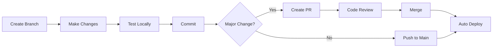

# Development Guide

> Complete guide for developing the WooCommerce SaaS Dashboard

---

## 📌 Maintaining This Document

**Update this file when you:**
- ✅ Add new external service integration (Coolify, WooCommerce, Stripe, etc.)
- ✅ Create new infrastructure (Edge Functions, nginx configs, Dockerfiles)
- ✅ Change deployment process or build configuration
- ✅ Add new development tools or workflows
- ✅ Discover important troubleshooting solutions
- ✅ Add new environment variables

**How to update:**
1. Update relevant section with new information
2. Update "Last Updated" metadata at bottom
3. Add entry to Update History table
4. Commit with `docs: Update DEVELOPMENT.md - [what changed]`

**See:** [.claude/documentation-rules.md](./.claude/documentation-rules.md) for complete update guidelines.

---

## 📋 Table of Contents

- [Getting Started](#getting-started)
- [External Services](#external-services)
- [Development Workflow](#development-workflow)
- [Working with Edge Functions](#working-with-edge-functions)
- [Coolify Deployment](#coolify-deployment)
- [Database Operations](#database-operations)
- [Testing](#testing)
- [Debugging](#debugging)
- [Security Guidelines](#security-guidelines)
- [Common Tasks](#common-tasks)
- [Troubleshooting](#troubleshooting)

---

## 🚀 Getting Started

### Prerequisites

- **Node.js** v20+ ([install with nvm](https://github.com/nvm-sh/nvm))
- **npm** or **bun**
- **Git** for version control
- **Code editor** (VS Code recommended)

### Initial Setup

```bash
# 1. Clone the repository
git clone https://github.com/itaymm211010/WooCommerce-SaaS-Dashboard.git
cd WooCommerce-SaaS-Dashboard

# 2. Install dependencies
npm install

# 3. Set up environment variables
cp .env.example .env
# Edit .env with your Supabase credentials

# 4. Start development server
npm run dev
```

### Environment Variables

Required in `.env`:

```env
# Supabase Configuration
VITE_SUPABASE_URL=https://xxx.supabase.co
VITE_SUPABASE_ANON_KEY=eyJhbGciOiJIUzI1NiIsInR5cCI6IkpXVCJ9...

# Coolify Integration (optional)
VITE_COOLIFY_URL=http://91.99.207.249:8000
VITE_COOLIFY_TOKEN=3|your_coolify_api_token_here

# Server-side only (never commit)
SUPABASE_SERVICE_ROLE_KEY=eyJhbGciOiJIUzI1NiIsInR5cCI6IkpXVCJ9...
```

**Important**: Never commit `.env` to git. The `.env.example` contains safe placeholders only.

**Coolify Variables:**
- `VITE_COOLIFY_URL` - Your Coolify instance URL
- `VITE_COOLIFY_TOKEN` - API token from Coolify Settings → API Tokens

---

## 🌐 External Services

This project integrates with several external services:

### Supabase (Backend as a Service)

**Purpose:** Database, Authentication, Edge Functions, Storage
**URL:** https://ddwlhgpugjyruzejggoz.supabase.co
**Access:** Lovable-managed instance

**Used For:**
- PostgreSQL database with Row Level Security (RLS)
- User authentication and authorization
- Edge Functions (serverless Deno functions)
- File storage for product images

**Documentation:** [Supabase Docs](https://supabase.com/docs)

---

### WooCommerce (E-commerce Platform)

**Purpose:** External store management and product synchronization
**API:** WooCommerce REST API v3

**Integration:**
- Products sync (pull from WooCommerce → Supabase)
- Products push (Supabase → WooCommerce)
- Taxonomies (categories, tags, brands)
- Webhooks for real-time updates

**Security:**
- All API calls proxied through `woo-proxy` Edge Function
- Credentials stored encrypted in Supabase
- Accessed via secure RPC function `get_store_credentials`

**Documentation:** [WooCommerce REST API](https://woocommerce.github.io/woocommerce-rest-api-docs/)

---

### Coolify (Deployment Platform)

**Purpose:** Self-hosted deployment management
**URL:** http://91.99.207.249:8000
**API Version:** v1

**Integration:**
- Application deployment and management
- Logs viewing
- Health monitoring
- Lifecycle control (start/stop/restart)

**Security:**
- nginx reverse proxy (`/api/coolify-proxy/`) to solve Mixed Content (HTTPS→HTTP)
- Alternative: `coolify-proxy` Edge Function
- API token stored in environment variables

**Features:**
- View deployed applications
- Monitor deployment status
- Read application logs
- Manage application lifecycle

**Setup:**
1. Get API token from Coolify Settings → API Tokens
2. Add to `.env.local`: `VITE_COOLIFY_URL` and `VITE_COOLIFY_TOKEN`
3. Test connection at `/coolify-test`

**See:** [Coolify Deployment](#coolify-deployment) for detailed setup

---

### OpenRouter (AI Gateway) - Optional

**Purpose:** Unified API for AI models (Claude, GPT-4, Gemini)
**Used By:** AI Agents (sync-health-agent, agent-coordinator)

**See:** [OPENROUTER-SETUP.md](./OPENROUTER-SETUP.md) for setup guide

---

## 🔄 Development Workflow

### Branch Strategy

We use **feature branches** for development:

```bash
# Create a new feature branch
git checkout -b feature/your-feature-name

# Or for bug fixes
git checkout -b fix/bug-description

# Or for documentation
git checkout -b docs/what-you-are-documenting
```

### Commit Message Format

Follow this structure:

```
type: Short description (max 50 chars)

Optional detailed explanation of what changed and why.
Include relevant issue numbers.

🤖 Generated with Claude Code
Co-Authored-By: Claude <noreply@anthropic.com>
```

**Types:**
- `feat:` - New feature
- `fix:` - Bug fix
- `refactor:` - Code refactoring
- `docs:` - Documentation changes
- `security:` - Security improvements
- `migration:` - Database migrations
- `test:` - Test additions or fixes
- `chore:` - Build/config changes

**Examples:**

```bash
# Good commits
git commit -m "feat: Add bulk product export functionality"
git commit -m "fix: Resolve duplicate image upload issue"
git commit -m "security: Implement RLS for webhook_logs table"

# Avoid
git commit -m "update"  # Too vague
git commit -m "fixed stuff"  # Not descriptive
```

### Development Cycle



**Process:**

1. **Create feature branch** from `main`
2. **Make changes** and test locally
3. **Commit frequently** with descriptive messages
4. **Push to GitHub**
5. **Create Pull Request** for major changes
6. **Wait for review** (or use AI reviewer)
7. **Merge** when approved
8. **Lovable auto-deploys** to production

### When to Use Pull Requests

**Use PRs for:**
- ✅ Security changes (RLS, credentials, authentication)
- ✅ Database migrations (schema changes)
- ✅ Major features or refactoring
- ✅ Breaking changes
- ✅ When you want code review

**Skip PRs for:**
- ❌ Typo fixes
- ❌ Documentation updates
- ❌ Minor UI tweaks
- ❌ Hotfixes (but document afterward)

### Code Review Process

```bash
# Request AI review with Claude Code
# In your PR description, ask: "Please review this PR for security issues"

# Manual review checklist:
# - [ ] Security: No credentials exposed
# - [ ] RLS: Policies updated for new tables
# - [ ] Tests: All tests pass
# - [ ] Migrations: Applied in correct order
# - [ ] Documentation: Updated if needed
# - [ ] CHANGELOG: Notable changes documented
```

---

## ⚙️ Working with Edge Functions

**Complete Reference:** See [supabase/functions/README.md](./supabase/functions/README.md) for detailed documentation on all Edge Functions.

### Available Edge Functions (16 total)

**Core API:**
- `woo-proxy` - Secure WooCommerce API proxy
- `coolify-proxy` - Coolify API proxy for Mixed Content security

**WooCommerce Sync:**
- `sync-woo-products` - Pull products from WooCommerce
- `update-woo-product` - Push product updates to WooCommerce
- `bulk-sync-to-woo` - Bulk product synchronization
- `sync-taxonomies` - Sync categories, tags, brands
- `sync-global-attributes` - Sync WooCommerce attributes
- `manage-taxonomy` - CRUD operations for taxonomies

**Webhooks:**
- `woocommerce-order-status` - Webhook receiver for order updates
- `generate-webhook-secret` - Generate secure webhook secrets

**AI & Automation:**
- `sync-health-agent` - AI monitoring of sync health
- `agent-coordinator` - Multi-agent orchestration
- `ai-chat` - AI chat assistance
- `detect-bugs` - AI-powered bug detection
- `handle-anomaly-response` - Automated anomaly responses

**User Management:**
- `reset-user-password` - Password reset functionality

**See:** [supabase/functions/README.md](./supabase/functions/README.md) for usage examples and security guidelines.
**AI Agents:** [supabase/functions/README-AGENTS.md](./supabase/functions/README-AGENTS.md) for AI agent system documentation.

### Lovable Cloud Deployment

**Important**: This project uses **Lovable-managed Supabase**, not standalone Supabase.

**What this means:**
- Edge Functions auto-deploy when you push to GitHub
- No direct Supabase CLI access without access token
- Migrations run via Lovable Cloud → SQL Editor
- Logs available in Lovable Cloud → Edge Functions

### Creating a New Edge Function

```bash
# 1. Create function directory
mkdir -p supabase/functions/your-function-name

# 2. Create index.ts
cat > supabase/functions/your-function-name/index.ts << 'EOF'
import { serve } from "https://deno.land/std@0.168.0/http/server.ts"
import { createClient } from 'https://esm.sh/@supabase/supabase-js@2'
import { withAuth } from '../_shared/auth-middleware.ts'
import { getStoreCredentials } from '../_shared/store-utils.ts'

serve(withAuth(async (req, auth) => {
  try {
    const { storeId } = await req.json()

    // Get store credentials securely
    const credentials = await getStoreCredentials(storeId)

    // Your logic here

    return new Response(
      JSON.stringify({ success: true }),
      { headers: { 'Content-Type': 'application/json' } }
    )
  } catch (error) {
    console.error('Error:', error)
    return new Response(
      JSON.stringify({ error: error.message }),
      { status: 500, headers: { 'Content-Type': 'application/json' } }
    )
  }
}))
EOF

# 3. Commit and push
git add supabase/functions/your-function-name/
git commit -m "feat: Add your-function-name edge function"
git push origin main

# 4. Lovable auto-deploys to Supabase
# 5. Verify in Lovable Cloud → Edge Functions
```

### Edge Function Security Checklist

Every Edge Function must:

- ✅ Use `withAuth` middleware for authentication
- ✅ Use `verifyStoreAccess` for authorization
- ✅ Use `getStoreCredentials` for credential access
- ✅ Never expose credentials in responses
- ✅ Log errors and important events
- ✅ Handle errors gracefully
- ✅ Return proper HTTP status codes

**Template:**

```typescript
import { serve } from "https://deno.land/std@0.168.0/http/server.ts"
import { withAuth, verifyStoreAccess } from '../_shared/auth-middleware.ts'
import { getStoreCredentials } from '../_shared/store-utils.ts'

serve(withAuth(async (req, auth) => {
  try {
    const { storeId, ...data } = await req.json()

    // Verify user has access to this store
    await verifyStoreAccess(auth.userId, storeId)

    // Get credentials securely
    const { api_key, api_secret } = await getStoreCredentials(storeId)

    // Your business logic

    return new Response(
      JSON.stringify({ success: true, data: result }),
      { headers: { 'Content-Type': 'application/json' } }
    )
  } catch (error) {
    console.error('[function-name] Error:', error)
    return new Response(
      JSON.stringify({ error: error.message }),
      { status: error.status || 500, headers: { 'Content-Type': 'application/json' } }
    )
  }
}))
```

### Shared Utilities

Located in `supabase/functions/_shared/`:

- **`auth-middleware.ts`** - `withAuth`, `verifyStoreAccess`
- **`store-utils.ts`** - `getStoreCredentials`, `getStoreDetails`
- **`webhook-middleware.ts`** - Webhook signature verification
- **`woocommerce-utils.ts`** - WooCommerce API helpers
- **`sync-logger.ts`** - Sync operation logging

Always import from `_shared` to maintain consistency.

### Testing Edge Functions Locally

Since we use Lovable Cloud, local testing is limited:

```bash
# Option 1: Test via deployed function
curl -X POST https://xxx.supabase.co/functions/v1/your-function \
  -H "Authorization: Bearer YOUR_ANON_KEY" \
  -H "Content-Type: application/json" \
  -d '{"storeId":"uuid-here"}'

# Option 2: View logs in Lovable Cloud
# Navigate to: Lovable Cloud → Edge Functions → Function Name → Logs
```

---

## 🚢 Coolify Deployment

This application deploys to Coolify using a custom Dockerfile and nginx configuration.

### Architecture

```
GitHub → Coolify Build → Docker Container → nginx → React App
                                          ↓
                                    Reverse Proxy
                                          ↓
                                   Coolify API (HTTP)
```

### Deployment Files

#### `Dockerfile` (Multi-stage Build)

```dockerfile
# Build stage - compile React app
FROM node:20-alpine AS builder
WORKDIR /app
COPY package*.json ./
RUN npm ci
COPY . .
RUN npm run build

# Production stage - serve with nginx
FROM nginx:alpine
COPY --from=builder /app/dist /usr/share/nginx/html
COPY nginx.conf /etc/nginx/conf.d/default.conf
EXPOSE 80
CMD ["nginx", "-g", "daemon off;"]
```

**Benefits:**
- ✅ Multi-stage reduces final image size (< 50MB)
- ✅ node:20-alpine for Node.js build
- ✅ nginx:alpine for production serving
- ✅ Only production files in final image

---

#### `nginx.conf` (SPA + Reverse Proxy)

Located in project root, copied to container during build.

**Key Features:**

1. **SPA Routing** - All routes serve `index.html` for React Router
```nginx
location / {
    try_files $uri $uri/ /index.html;
}
```

2. **Coolify API Proxy** - Solves Mixed Content (HTTPS→HTTP)
```nginx
location /api/coolify-proxy/ {
    proxy_pass http://91.99.207.249:8000/;
    proxy_http_version 1.1;
    proxy_set_header Host $host;
    proxy_set_header X-Real-IP $remote_addr;
    proxy_set_header X-Forwarded-For $proxy_add_x_forwarded_for;
    proxy_set_header X-Forwarded-Proto $scheme;

    # CORS headers
    add_header Access-Control-Allow-Origin *;
    add_header Access-Control-Allow-Methods 'GET, POST, PUT, DELETE, OPTIONS';
    add_header Access-Control-Allow-Headers 'Authorization, Content-Type, Accept';
}
```

3. **Static Asset Caching**
```nginx
location /assets/ {
    expires 1y;
    add_header Cache-Control "public, immutable";
}
```

4. **Gzip Compression**
```nginx
gzip on;
gzip_types text/plain text/css application/json application/javascript text/xml application/xml;
```

**Why nginx Proxy?**
- Application runs on HTTPS (`https://app.ssw-ser.com`)
- Coolify API is HTTP (`http://91.99.207.249:8000`)
- Browsers block Mixed Content (HTTPS → HTTP)
- nginx proxies requests: `https://app/api/coolify-proxy/*` → `http://coolify:8000/*`

---

### Coolify Configuration

#### Build Pack Setting

**IMPORTANT:** Set Build Pack to **"Dockerfile"** in Coolify UI.

**Steps:**
1. Go to Coolify → Your Application → Configuration
2. Find "Build Pack" dropdown
3. Select **"Dockerfile"**
4. Save

**Why:** Coolify defaults to `nixpacks` auto-detection, which may detect the project incorrectly (e.g., as Deno instead of Node.js). Using "Dockerfile" forces Coolify to use your custom Dockerfile.

---

#### Environment Variables in Coolify

Add these in Coolify UI → Environment Variables:

```env
VITE_SUPABASE_URL=https://ddwlhgpugjyruzejggoz.supabase.co
VITE_SUPABASE_ANON_KEY=your_anon_key
VITE_COOLIFY_URL=http://91.99.207.249:8000
VITE_COOLIFY_TOKEN=your_coolify_token
```

**Note:** These are build-time variables, injected during `npm run build`.

---

### Deployment Workflow

```bash
# 1. Make changes locally
git add .
git commit -m "feat: Add new feature"

# 2. Push to GitHub
git push origin your-branch

# 3. Coolify auto-detects push (if webhook configured)
# Or manually trigger: Coolify UI → Deploy → Force Rebuild Without Cache

# 4. Coolify builds Docker image
# - Runs Dockerfile
# - Injects environment variables
# - Creates container

# 5. Deployment complete
# - Application available at https://app.ssw-ser.com
# - nginx serves static files
# - Reverse proxy handles /api/coolify-proxy/*
```

---

### Troubleshooting Coolify Deployments

#### Issue: Docker Cache Prevents New Code Deployment

**Symptoms:**
```
No configuration changed & image found
Build step skipped
#9 CACHED
```

**Solution:**
```bash
# Option 1: Force Rebuild in Coolify UI
Coolify → Application → Deploy → "Force Rebuild Without Cache"

# Option 2: Delete Docker images on Coolify server
ssh into Coolify server:
docker rmi -f <image-id>
docker builder prune -af

# Option 3: Modify files to break cache
# Add a comment to Dockerfile or nginx.conf
```

---

#### Issue: Wrong Build Pack (Deno Detection)

**Symptoms:**
```
error: Relative import path "@/components/ui/skeleton" not prefixed with / or ./ or ../
RUN deno cache src/pages/audit-logs/index.tsx
```

**Cause:** Coolify using `nixpacks` instead of Dockerfile

**Solution:**
1. Delete `nixpacks.toml` if it exists (Coolify prioritizes it)
2. Change Build Pack to "Dockerfile" in Coolify UI
3. Force Rebuild Without Cache

---

#### Issue: nginx.conf Not Applied

**Symptoms:** `/coolify-test` shows 404, SPA routing broken

**Cause:** Old nginx config cached in Docker image

**Solution:**
1. Modify nginx.conf (add comment to break cache)
2. Ensure Build Pack is "Dockerfile"
3. Force Rebuild Without Cache
4. Verify nginx.conf is in container:
```bash
docker exec -it <container> cat /etc/nginx/conf.d/default.conf
```

---

#### Issue: Environment Variables Not Working

**Symptoms:** `undefined` for `VITE_COOLIFY_URL`

**Cause:** Variables not set in Coolify or missing `VITE_` prefix

**Solution:**
1. Check Coolify UI → Environment Variables
2. Ensure all variables have `VITE_` prefix
3. Rebuild (environment variables are build-time)

---

#### Issue: Unhealthy State in Coolify

**Symptoms:** Application shows "Unhealthy" despite working

**Cause:** Health check endpoint not configured

**Solution:**
- If app works, this is informational only
- Configure health check in Coolify UI (optional):
  - Path: `/`
  - Expected: 200 status

---

### Testing Coolify Integration

After deployment, test the Coolify integration:

1. **Visit Test Page**
   ```
   https://app.ssw-ser.com/coolify-test
   ```

2. **Click "Test Coolify Connection"**
   - Should show success message
   - Should display list of applications from Coolify

3. **Verify nginx Proxy**
   ```bash
   # Test from browser console
   fetch('/api/coolify-proxy/api/v1/applications', {
     headers: {
       'Authorization': 'Bearer YOUR_COOLIFY_TOKEN'
     }
   }).then(r => r.json()).then(console.log)
   ```

4. **Check Browser Network Tab**
   - Should see requests to `/api/coolify-proxy/*`
   - Should NOT see Mixed Content errors

---

### Alternative: Edge Function Proxy

Instead of nginx reverse proxy, you can use the `coolify-proxy` Edge Function:

**Pros:**
- ✅ Centralized with other proxies (woo-proxy pattern)
- ✅ Can add authentication/logging
- ✅ Works even if nginx config changes

**Cons:**
- ❌ Extra hop (frontend → Edge Function → Coolify)
- ❌ Supabase Edge Function costs

**Usage:**
```typescript
const { data, error } = await supabase.functions.invoke('coolify-proxy', {
  body: {
    path: '/api/v1/applications',
    method: 'GET'
  }
})
```

**See:** [supabase/functions/README.md](./supabase/functions/README.md) for details.

---

### Coolify API Integration Code

**Service:** `src/services/CoolifyService.ts`

```typescript
class CoolifyService {
  private config: CoolifyConfig | null = null

  initialize(url: string, token: string) {
    this.config = { url, token }
  }

  async getApplications(): Promise<CoolifyApiResponse<CoolifyApplication[]>> {
    // Uses nginx reverse proxy
    const proxyUrl = `/api/coolify-proxy/api/v1/applications`

    const response = await fetch(proxyUrl, {
      headers: {
        'Authorization': `Bearer ${this.config.token}`,
        'Accept': 'application/json'
      }
    })

    return response.json()
  }
}

export const coolifyService = CoolifyService.getInstance()
```

**Test Page:** `src/pages/CoolifyTest.tsx`
**Route:** `/coolify-test`

---

## 🗄️ Database Operations

### Creating Migrations

```bash
# 1. Create migration file
# Format: YYYYMMDDHHMMSS_description.sql
touch supabase/migrations/$(date +%Y%m%d%H%M%S)_add_new_table.sql

# 2. Write SQL
cat > supabase/migrations/$(date +%Y%m%d%H%M%S)_add_new_table.sql << 'EOF'
-- Add new table
CREATE TABLE IF NOT EXISTS your_table (
  id UUID PRIMARY KEY DEFAULT gen_random_uuid(),
  store_id UUID NOT NULL REFERENCES stores(id) ON DELETE CASCADE,
  created_at TIMESTAMP WITH TIME ZONE DEFAULT NOW(),
  updated_at TIMESTAMP WITH TIME ZONE DEFAULT NOW()
);

-- Enable RLS
ALTER TABLE your_table ENABLE ROW LEVEL SECURITY;

-- RLS Policies
CREATE POLICY "Users can access their store data"
  ON your_table FOR ALL
  USING (
    EXISTS (
      SELECT 1 FROM stores
      WHERE stores.id = your_table.store_id
      AND stores.user_id = auth.uid()
    )
  );

-- Indexes
CREATE INDEX idx_your_table_store_id ON your_table(store_id);

-- Comments
COMMENT ON TABLE your_table IS 'Description of your table';
EOF

# 3. Commit migration
git add supabase/migrations/
git commit -m "migration: Add your_table for feature X"
git push

# 4. Lovable auto-runs migrations (usually)
# ⚠️ IMPORTANT: Lovable SHOULD auto-apply migrations from GitHub
# However, if migrations don't run automatically:

# Option A: Check Lovable Dashboard
# - Go to your Lovable project dashboard
# - Check if there are pending migrations to approve
# - Lovable may require manual approval for destructive changes

# Option B: Manual migration (if auto-run fails)
# - You'll need to ask the project owner with Lovable access
# - They can run it via Lovable Cloud → Database → SQL Editor
# - Or contact Lovable support if migrations are stuck
```

### RLS Policy Template

Every table must have RLS enabled:

```sql
-- Enable RLS
ALTER TABLE your_table ENABLE ROW LEVEL SECURITY;

-- Multi-tenant access policy
CREATE POLICY "Users can manage their store data"
  ON your_table FOR ALL
  USING (
    EXISTS (
      SELECT 1 FROM stores
      WHERE stores.id = your_table.store_id
      AND stores.user_id = auth.uid()
    )
  );

-- Service role bypass (for Edge Functions)
CREATE POLICY "Service role has full access"
  ON your_table FOR ALL
  TO service_role
  USING (true)
  WITH CHECK (true);
```

### Updating Database Schema

After schema changes:

```bash
# 1. Generate new TypeScript types
npx supabase gen types typescript --project-id YOUR_PROJECT_ID > src/integrations/supabase/types.ts

# 2. Commit type updates
git add src/integrations/supabase/types.ts
git commit -m "chore: Update database types"
```

---

## 🧪 Testing

### Frontend Testing

```bash
# Run linter
npm run lint

# Build for production
npm run build

# Preview production build
npm run preview
```

### Manual Testing Checklist

Before deploying major changes:

- [ ] Authentication works (login/logout)
- [ ] Store creation and editing
- [ ] Product CRUD operations
- [ ] WooCommerce sync (pull and push)
- [ ] Webhook delivery and logging
- [ ] Multi-tenancy (users see only their stores)
- [ ] Security (credentials not exposed)
- [ ] Error handling (network failures, API errors)

### Security Testing

```bash
# Check for exposed secrets
git secrets --scan

# Verify RLS policies
# Run in Lovable Cloud → Database → SQL Editor:
SELECT tablename, policyname, cmd, qual
FROM pg_policies
WHERE schemaname = 'public'
ORDER BY tablename, policyname;

# Test unauthorized access (should fail)
# Try accessing another user's store via API
```

---

## 🐛 Debugging

### Frontend Debugging

```bash
# Enable verbose logging
# In browser console:
localStorage.setItem('debug', '*')

# View network requests
# Chrome DevTools → Network → Filter by "supabase" or "woo"

# React Query DevTools
# Available in dev mode at bottom-left corner
```

### Edge Function Debugging

```bash
# View logs in Lovable Cloud
# Navigate to: Lovable Cloud → Edge Functions → Function Name → Logs

# Add console.log statements
console.log('[function-name] Debug info:', variable)
console.error('[function-name] Error:', error)

# Check Edge Function status
curl https://xxx.supabase.co/functions/v1/your-function/health
```

### Common Issues

**Issue: "No rows returned" from `get_store_credentials`**
- **Cause**: User doesn't have access to store
- **Fix**: Verify user_id matches store.user_id

**Issue: "Failed to fetch" from WooCommerce API**
- **Cause**: Invalid credentials or unreachable store URL
- **Fix**: Test credentials manually in Postman/curl

**Issue: Edge Function not deploying**
- **Cause**: Lovable Cloud sync delay
- **Fix**: Wait 2-3 minutes, check Lovable Cloud logs

**Issue: RLS policy blocking access**
- **Cause**: Missing or incorrect RLS policy
- **Fix**: Review policies, ensure user_id check is correct

---

## 🔐 Security Guidelines

### Critical Rules

1. **NEVER** commit credentials to git
   - Use `.env` for secrets (gitignored)
   - Use environment variables in Edge Functions

2. **NEVER** expose credentials in client code
   - Always use `woo-proxy` for WooCommerce API calls
   - Never pass `api_key` or `api_secret` to frontend

3. **ALWAYS** use RLS policies
   - Every table must have RLS enabled
   - Test policies with different users

4. **ALWAYS** use `withAuth` middleware
   - All Edge Functions must authenticate requests
   - Use `verifyStoreAccess` for multi-tenant checks

5. **ALWAYS** log security events
   - Credential access → `credential_access_logs`
   - Failed auth attempts → logs
   - Suspicious activity → alerts

### Using woo-proxy Pattern

**Frontend code - CORRECT:**

```typescript
const { data, error } = await supabase.functions.invoke('woo-proxy', {
  body: {
    storeId: store.id,
    endpoint: '/wp-json/wc/v3/products',
    method: 'GET'
  }
})
```

**Frontend code - WRONG (NEVER DO THIS):**

```typescript
// ❌ WRONG - Credentials exposed
const response = await fetch(
  `${store.url}/wp-json/wc/v3/products?consumer_key=${api_key}&consumer_secret=${api_secret}`
)
```

### Security Review Checklist

Before merging security-related PRs:

- [ ] No credentials in client-side code
- [ ] All API calls use `woo-proxy` or Edge Functions
- [ ] RLS policies updated for new tables
- [ ] `withAuth` and `verifyStoreAccess` used
- [ ] Error messages don't leak sensitive data
- [ ] Audit logging in place
- [ ] Input validation implemented
- [ ] SQL injection prevention (parameterized queries)
- [ ] XSS prevention (sanitized output)

---

## 🔧 Common Tasks

### Adding a New WooCommerce Endpoint

```typescript
// In frontend component
const syncOrders = async () => {
  const { data, error } = await supabase.functions.invoke('woo-proxy', {
    body: {
      storeId: store.id,
      endpoint: '/wp-json/wc/v3/orders',  // New endpoint
      method: 'GET',
      params: {  // Optional query params
        per_page: 100,
        status: 'processing'
      }
    }
  })

  if (error) {
    console.error('Failed to fetch orders:', error)
    return
  }

  // Process orders
  console.log('Orders:', data)
}
```

### Adding a New Sync Operation

1. Create Edge Function (e.g., `sync-woo-orders`)
2. Implement sync logic with retry/backoff
3. Log sync events to `sync_logs`
4. Update `synced_at` timestamp
5. Handle conflicts (compare timestamps)

### Adding a New Table

1. Create migration with table + RLS
2. Update TypeScript types
3. Add frontend queries/mutations
4. Implement CRUD Edge Functions if needed
5. Document in PROJECT_STRUCTURE.md

---

## 🆘 Troubleshooting

### Build Fails

```bash
# Clear cache and reinstall
rm -rf node_modules package-lock.json
npm install

# Check for TypeScript errors
npm run build
```

### Deployment Issues

```bash
# Verify Lovable connection
# Check: Lovable Cloud → Settings → GitHub Integration

# Manual redeploy
# Push an empty commit to trigger Lovable
git commit --allow-empty -m "chore: trigger redeploy"
git push
```

### Database Connection Issues

```bash
# Verify Supabase credentials
echo $VITE_SUPABASE_URL
echo $VITE_SUPABASE_ANON_KEY

# Test connection
curl https://xxx.supabase.co/rest/v1/ \
  -H "apikey: YOUR_ANON_KEY"
```

### WooCommerce API Issues

```bash
# Test credentials manually
curl https://yourstore.com/wp-json/wc/v3/products \
  -u "consumer_key:consumer_secret"

# Check WooCommerce REST API status
# Navigate to: WordPress Admin → WooCommerce → Status → REST API
```

---

## 📚 Additional Resources

- [PROJECT_STRUCTURE.md](./PROJECT_STRUCTURE.md) - Architecture overview
- [CONTRIBUTING.md](./CONTRIBUTING.md) - Contribution guidelines
- [CHANGELOG.md](./CHANGELOG.md) - Version history
- [.claude/project-context.md](./.claude/project-context.md) - AI context
- [Lovable Documentation](https://docs.lovable.dev/)
- [Supabase Documentation](https://supabase.com/docs)
- [WooCommerce REST API](https://woocommerce.github.io/woocommerce-rest-api-docs/)

---

## 🎯 Quick Commands Reference

```bash
# Development
npm run dev           # Start dev server
npm run build         # Build for production
npm run preview       # Preview production build
npm run lint          # Run linter

# Git
git checkout -b feature/name   # Create feature branch
git add .                      # Stage changes
git commit -m "type: message"  # Commit with message
git push origin branch-name    # Push to GitHub

# Testing
curl -X POST https://xxx.supabase.co/functions/v1/function-name \
  -H "Authorization: Bearer ANON_KEY" \
  -d '{"key":"value"}'
```

---

**Happy Coding! 🚀**

---

**📌 Maintenance Info**

**Last Updated:** 2025-11-23
**Last Commit:** `533a2db` - Comprehensive documentation update with Coolify integration
**Updated By:** Claude Code

**Update History:**
| Date | Commit | Changes | Updated By |
|------|--------|---------|------------|
| 2025-11-23 | `533a2db` | Added Coolify Deployment section, External Services section, Edge Functions list | Claude Code |
| 2025-11-08 | N/A | Initial DEVELOPMENT.md creation | Developer |
